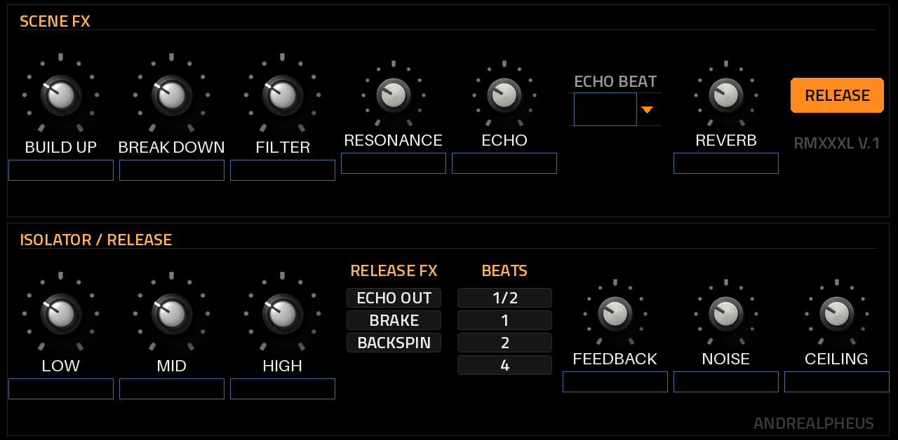
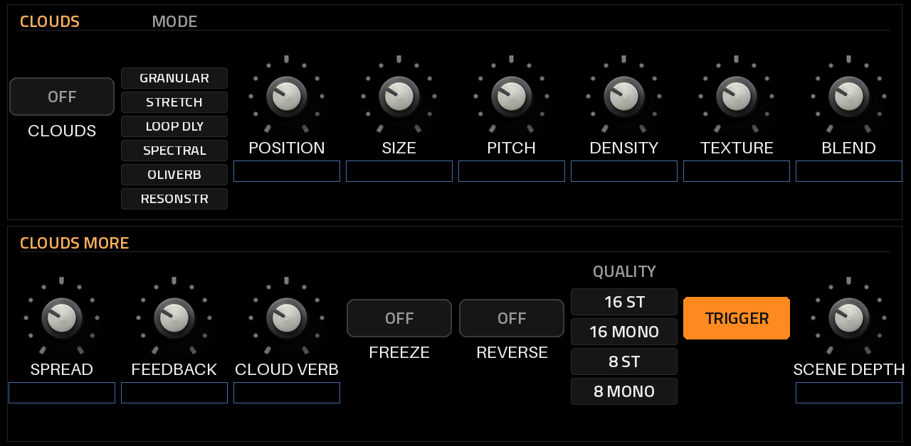
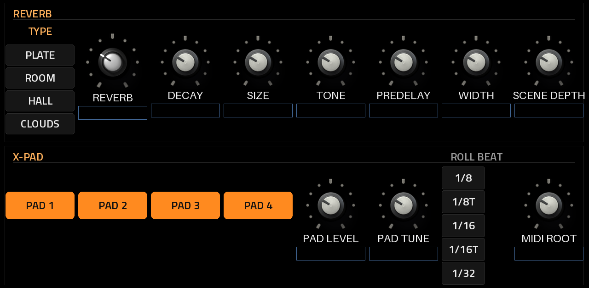
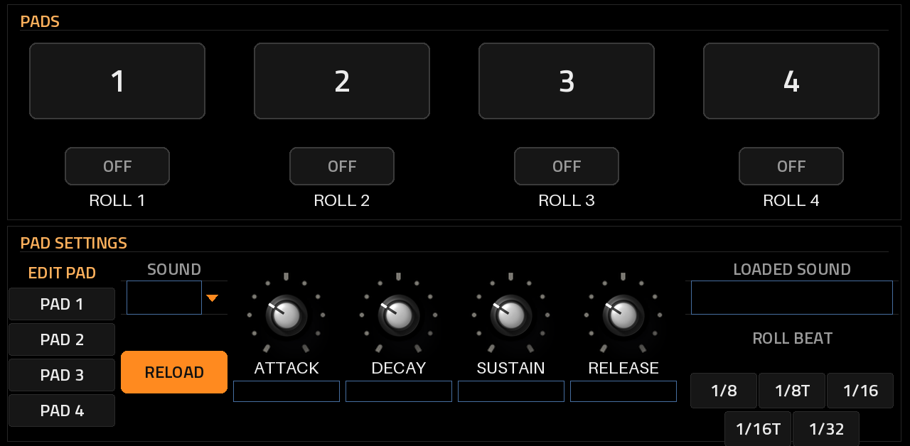

# RMXXXL v1.2.1

**An RMX-1000-style remix effect that runs natively inside MPC OS on the Akai Force.**

RMXXXL is a VST2 insert effect for MPC OS's built-in plugin host, made by L'Cronx (shown on the device as
**ANDREALPHEUS**). Put it on a track, a submix or the master and play the mix live: build-ups, breakdowns,
filter sweeps, band kills, echoes, reverb washes, granular textures, drum and sample pads, a Release kill switch that
drops everything back to dry, and a Panic button. Everything sits in one insert slot, with its own touchscreen pages and Q-Link sets.

> [!NOTE]
> **Status: 1.2.1, tested on an Akai Force** (MPC OS 3.9.1 with MockbaMod). It fixes what the 1.1.1 test found (see
> the [changelog](CHANGELOG.md)) and passes the full test suite on x86 (ASan + UBSan). Report anything odd under
> [Issues](../../issues).



*The REMIX page, rendered offline from the skin (on the device MPC fills in the values).*

## Highlights

- **Scene FX:** Build Up and Break Down are one knob each, moving the filter, echo, Clouds, reverb and a noise
  riser together. Release latches them off until both knobs are back at zero, like the RMX.
- **Isolator:** 3-band Linkwitz-Riley 8th-order kill EQ with Mixxx's design and crossovers (246 Hz / 2.48 kHz).
- **DJ filter:** one bipolar knob, low-pass to the left, high-pass to the right, with resonance.
- **Echo:** synced to the MPC tempo, 1/16 to 1 bar, damped feedback.
- **Release:** a kill switch. On, the whole effect goes to the dry input (Hard: instant, Smooth: a fade over 1/2 to 4
  beats) and stays there; off, everything comes back as it was. No knob moves.
- **Release FX:** Echo Out, Vinyl Brake or Backspin over 1/2, 1, 2 or 4 beats, on its own button.
- **Panic:** one tap back to factory settings, every tail cleared; your pad setup stays.
- **Presets:** 16 slots of your own, saved on the device, pad sounds and envelopes included.
- **Clouds:** Mutable Instruments Clouds with the Parasites firmware, all six modes (granular, stretch, looping
  delay, spectral, Oliverb, Resonestor).
- **Reverb:** Dragonfly Plate, Room and Hall inside the plugin, or Clouds' own reverb as the light option.
- **Pads:** four pads from the screen, MIDI or latching rolls; each has its own ADSR and plays its built-in drum
  or one of 16 swappable WAV one-shots.
- **Noise riser:** with Tune (±24 semitones) and Duck (pumps it under the incoming beat).
- **Brickwall limiter:** look-ahead, Drive in, Ceiling out.
- **Skin:** black, BLACK and GREY knob art on a tick scale, big buttons and switches, all text (lists included) in
  one readable size.
- **MIDI:** play the pads, rolls, Release FX, Release and Panic from a MIDI track (below).

| | | |
| --- | --- | --- |
|  |  |  |

## MIDI: playing RMXXXL from a MIDI track

MPC OS doesn't send MIDI to insert effects, so each RMXXXL instance opens **its own MIDI input port**, `RMXXXL 1`
(then `RMXXXL 2`, ... for more instances). A MIDI track sends its notes to that port; RMXXXL keeps processing the audio
of whatever track or master it is inserted on.

```
 MIDI track (pads / clip)  --MIDI Out-->  port "RMXXXL 1"  -->  RMXXXL (inserted on a track, submix or the master)
```

**Setup, once per project**

1. Insert **RMXXXL** on the track, submix or master you want to effect.
2. Create a **MIDI track** (no instrument needed).
3. Set the MIDI track's **MIDI output port** to **`RMXXXL 1`** (any channel: RMXXXL listens to all 16). If the list
   shows `RMXXXL 2` or higher, the plugin was inserted more than once this session: pick the number that's listed.
4. Select the MIDI track and play its pads, or record / draw notes in its clips.
5. Line the notes up with your pads: use a **chromatic** pad layout, then set **MIDI Root** (REVERB / PADS page,
   default **36 = C1**, MPC numbering where 60 = C3) to the note of the pad you want as Pad 1.

**Note map** (from MIDI Root)

| Default note | Offset | Action |
| --- | --- | --- |
| 36–39 (C1–D#1) | +0..+3 | Pads 1–4, one-shot, velocity = level |
| 40–43 (E1–G1) | +4..+7 | Pads 1–4 as rolls while held, at Roll Beat, locked to the tempo |
| 44 (G#1) | +8 | Release FX (Echo Out / Brake / Backspin) |
| 45 (A1) | +9 | Release on / off (each note switches it) |
| 46 (A#1) | +10 | Panic |

**If nothing happens:** the port only exists while RMXXXL is inserted; after removing and re-inserting it the number
can change (re-select it on the MIDI track); and the notes must land between MIDI Root and MIDI Root + 10. The
[user guide](docs/USER_GUIDE.md#midi-playing-the-pads-from-a-midi-track) has the full walkthrough.

## Documentation

| Document | What's in it |
| --- | --- |
| [User guide](docs/USER_GUIDE.md) | Install, every page and control, MIDI, Q-Links, samples, troubleshooting |
| [Changelog](CHANGELOG.md) | What changed in each version |
| [Roadmap](ROADMAP.md) | Bugs and changes planned for the next versions |

## Requirements

- An **Akai Force** (first generation). Other first-generation MPC OS units (MPC Live / Live II, One, X,
  Key 61) should work but are untested.
- **Root SSH access** to the device, for example through MockbaMod. Stock MPC OS can't install third-party
  plugins.
- **MPC OS 3.x.** The skin uses the 3.x format.

## Installation

Download `RMXXXL-<version>-mpc-armv7.zip` from [Releases](../../releases), or build it (below). Unzip it and
follow the `INSTALL.md` inside. In short:

```
scp -r RMXXXL-<version> root@<device-ip>:/tmp/
ssh -t root@<device-ip> sh /tmp/RMXXXL-<version>/install.sh
```

The installer asks for confirmation (`-y` skips it), **stops MPC** (save your project first), copies the plugin
to `/sdcard/Synths/ANDREALPHEUS - VST - RMXXXL/`, backs up and edits `MPC.settings`, and starts MPC again.
Running it again upgrades in place. Then insert **RMXXXL** (manufacturer ANDREALPHEUS) on a track, submix or the
master. `uninstall.sh` removes it the same way.

Pad samples go in `/sdcard/RMXXXL Samples` (created on first load) and presets in `/sdcard/RMXXXL Presets`, both
outside the plugin folder, so they survive updates.

## Building

Linux or WSL with Python 3 (+ Pillow), gcc and [Zig](https://ziglang.org/) (`pip install ziglang pillow numpy`). No
Docker.

```
git clone --recursive https://github.com/sunskiefer/RMXXXL
cd RMXXXL
./build.sh                # build/arm/rmxxxl.so + the skin -> build/package/
test/run_tests.sh         # the framework's host test + RMXXXL's own suite, under ASan/UBSan
```

`tools/gen_params.py` is the single source of the parameter list (it writes `params.json` and
`src/param_table.h`). MPC stores automation by parameter index, so from now on parameters are appended only.

## Related projects

- [mpc-vst-plugins](https://github.com/sd88me/mpc-vst-plugins) by sd88me: the framework RMXXXL is built on, and
  the plugin catalog.
- [EffectForce](https://github.com/Devko/EffectForce) by Devko: an effect rack for the Force that is already
  available, with ten reorderable modules, modulation and an Octatrack-style performance mixer.
- [Overcast](https://github.com/FullPace/overcast) and [mpc-vst-dragonfly](https://github.com/gmorb/mpc-vst-dragonfly):
  the Clouds and Dragonfly ports RMXXXL takes its granular and reverb engines from.

## License

RMXXXL is released under the **GNU GPL v3.0 or later** ([LICENSE](LICENSE)), because it includes Dragonfly
Reverb. Third-party components keep their own licenses (below).

## Credits

- **Isolator and filter:** designs follow [Mixxx](https://github.com/mixxxdj/mixxx) 2.5 (GPL-2.0-or-later):
  `linkwitzriley8eqeffect.cpp`, `enginefilterlinkwitzriley8.cpp`, `filtereffect.cpp`, re-implemented here.
- **Clouds:** Emilie Gillet (Mutable Instruments), with Matthias Puech's Parasites firmware (MIT). MPC OS port by
  FullPace ([overcast](https://github.com/FullPace/overcast)), vendored from there; two local fixes for undefined
  shifts (`clouds/dsp/correlator.cc`, `clouds/dsp/looping_sample_player.h`), same results.
- **MIDI input port and Clouds engine glue:** after FullPace's [overcast](https://github.com/FullPace/overcast) (MIT).
- **Reverbs:** Dragonfly Reverb by Michael Willis and Rob van den Berg, built on freeverb3 by Teru Kamogashira
  (GPL-3.0-or-later). MPC OS port by gmorb ([mpc-vst-dragonfly](https://github.com/gmorb/mpc-vst-dragonfly)),
  vendored from there.
- **VST2 wrapper, skin generator, installer:** sd88me ([mpc-vst-plugins](https://github.com/sd88me/mpc-vst-plugins))
  (MIT), as a submodule in `third_party/mpc-vst-plugins`.
- **Interface font:** [Titillium Web](https://fonts.google.com/specimen/Titillium+Web), SIL Open Font License 1.1
  (`art/fonts/OFL.txt`).
- **Knob artwork** (`art/`): supplied by L'Cronx.

RMXXXL is not affiliated with or endorsed by Pioneer DJ, Akai Professional, Mutable Instruments or the Mixxx
project.
