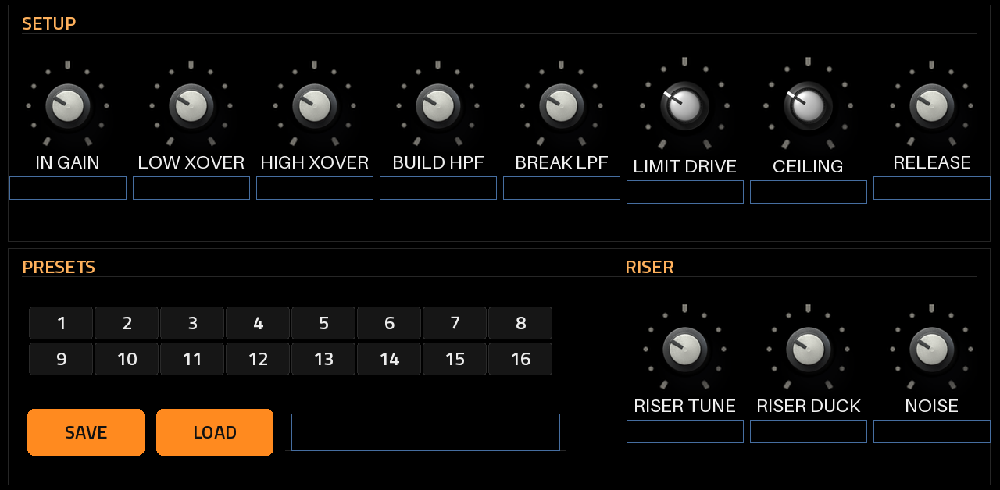

# RMXXXL v.1 — User Guide

## What RMXXXL is

RMXXXL v.1 by ANDREALPHEUS is a performance remix effect in the spirit of the Pioneer RMX-1000. It runs as **one native insert effect** inside MPC OS on first-generation standalone hardware: Akai Force, MPC Live / Live II, One, X and Key 61.

Put it on a track, a submix or the master, and play the mix live with big macro moves: build-ups, breakdowns, filter sweeps, band kills, echoes, reverb washes, granular textures, drum and sample hits and a release button that snaps everything back.

Status: version 1.2.1, tested on an Akai Force (MPC OS 3.9.1 with MockbaMod). It fixes what the 1.1.1 test found and passes the offline tests. The other Gen1 units are untested.

**Signal flow**, in order:

1. **In Gain**: trims the incoming signal.
2. **Isolator**: 3-band kill EQ (Low / Mid / High), Linkwitz-Riley 8th order, as in Mixxx.
3. **Filter**: one bipolar knob, low-pass to the left and high-pass to the right, with resonance, as in Mixxx.
4. **Clouds**: the Mutable Instruments Clouds granular processor with the Parasites firmware, six modes.
5. **Echo**: tempo-synced, plus the noise riser used by Build Up (with its own Tune and Duck).
6. **Reverb**: Dragonfly Plate, Room or Hall, or Clouds' own reverb.
7. **Release FX tape**: Echo Out, Vinyl Brake or Backspin.
8. **Release**: the kill switch. On, everything above is crossfaded away to the dry input.
9. **Pads**: four pads (built-in drums or your samples), each with its own ADSR, played over the top.
10. **Brickwall limiter**: Drive in, Ceiling out.

**Scene FX** are the heart of it. **Build Up** raises a high-pass filter, feeds the echo and reverb and brings in a noise riser. **Break Down** closes a low-pass filter and washes the sound into echo and reverb. One knob each moves all of those at once.

The plugin has five pages: **REMIX** (the performance page), **CLOUDS**, **REVERB / PADS**, **PADS** and **SETUP**. It follows the MPC's tempo, and saves and recalls all settings with the project.

## Installation

Installing takes one script run over SSH. The script stops MPC, backs up its settings, installs the plugin and starts MPC again.

**Requirements**

- A first-generation MPC OS standalone unit: Force, MPC Live / Live II, One, X or Key 61. The installer refuses anything else.
- MPC OS 3.x. The screen skin uses the 3.x format; MPC OS 2.x is not supported.
- Root SSH access to the device. Stock MPC OS doesn't offer this, so you need a modded unit (for example MockbaMod).
- The release file `RMXXXL-<version>-mpc-armv7.zip` from the repository's Releases.

Installing plugins this way is unofficial. Back up your projects first.

**Install**

1. Save your project on the device.
2. Unzip `RMXXXL-<version>-mpc-armv7.zip` on your computer. You get a folder `RMXXXL-<version>`.
3. Copy the folder to the device: `scp -r RMXXXL-<version> root@<device-ip>:/tmp/`
4. Run the installer: `ssh -t root@<device-ip> sh /tmp/RMXXXL-<version>/install.sh`
5. Confirm when it asks. It stops MPC, copies the plugin folder `ANDREALPHEUS - VST - RMXXXL` into `/sdcard/Synths`, backs up `MPC.settings`, adds the plugin to MPC's plugin list and starts MPC again.
6. On the device, open a track's insert effects and load **RMXXXL** (manufacturer **ANDREALPHEUS**).

Installer options: `-y` skips the confirmation prompt, and `-t <folder>` installs into another Synths folder, for example on a card.

**Update**: run the newer version's `install.sh` the same way. It upgrades in place.

**Uninstall**: `ssh -t root@<device-ip> sh /tmp/RMXXXL-<version>/uninstall.sh` removes the plugin folder and its plugin-list entry, then restarts MPC.

## Controls, page by page

Each page has a top row and a bottom row of controls. Turn knobs on the touchscreen or with the Q-Links; tap buttons and option lists.


### REMIX (performance page)

| Control | What it does |
| --- | --- |
| Build Up | Scene macro: raises a high-pass filter (up to Build HPF), adds echo, reverb and the noise riser |
| Break Down | Scene macro: closes a low-pass filter (down to Break LPF), adds echo and reverb |
| Filter | Centre = off. Left = low-pass sweeping down, right = high-pass sweeping up |
| Resonance | Filter resonance, Q 0.4 to 4 (automatically limited when both filters are close) |
| Echo | Echo send amount |
| Echo Beat | Echo time: 1/16, 1/8, 3/16, 1/4, 3/8, 1/2, 3/4 or 1 bar, following the MPC tempo (button row) |
| Reverb | Reverb send amount (type and character are set on the REVERB page) |
| Release (ON / OFF) | The kill switch. **On**: the whole effect goes to the dry input and stays dry. **Off**: the effects come back exactly as they were. It never moves a knob |
| Hard / Smooth | How Release switches. **Hard**: an instant cut (5 ms, no click). **Smooth**: a fade over **Beats**, both ways |
| Low / Mid / High | Isolator bands. Fully left = Kill, centre = unchanged, fully right = +6 dB |
| Release FX (list) | Echo Out (repeats the last echo beat and fades), Brake (vinyl stop) or Backspin |
| Beats | Length of the Release FX and of a Smooth Release: 1/2, 1, 2 or 4 beats |
| RELEASE FX (button) | Fires the selected Release FX |
| PANIC | Back to factory settings at once (see below) |
| Feedback | Echo feedback; Build Up and Break Down add more on top |

The lower half is one panel of big buttons: **Echo Beat** (1/16 to 1 bar), **Release FX** and **Beats**, then the
**RELEASE FX** and **PANIC** buttons. The riser's Noise amount, Tune and Duck are on SETUP (and Noise on a REMIX Q-Link).

While Release is on, the effects keep running underneath (echoes keep repeating, the reverb keeps ringing), so switching it off drops you straight back into the mix as it was. The pads are not muted: you can keep playing them over the dry signal.

After the **RELEASE FX** button, Build Up and Break Down are latched off, like the RMX snapping back to dry. Turn both knobs back to zero to re-arm them.

**PANIC** puts every effect control back to its factory value (as a freshly installed RMXXXL, whatever the project saved), switches Release off, stops the pads and rolls, and clears every echo, reverb and release tail. Your pad setup stays: each pad's sound and envelope, Pad Level, Pad Tune, Roll Beat and MIDI Root, and the preset slot.

### CLOUDS


| Control | What it does |
| --- | --- |
| Clouds | Switches the Clouds processor on or off (with a short crossfade) |
| Mode | Granular, Stretch, Loop Delay (default), Spectral, Oliverb or Resonestor. A change takes effect within 0.5 s |
| Position, Size, Pitch, Density, Texture | The module's main controls. Their names on the Q-Link display change per mode, as on the module |
| Blend | Clouds mix. Up to 50 % the dry stays at full level and Clouds is added on top; above 50 % the dry fades out. At 0 % Clouds on sounds exactly like Clouds off |
| Spread, Feedback, Cloud Verb | Stereo spread, feedback and Clouds' own reverb |
| Freeze, Reverse | Freeze the buffer; play grains reversed |
| Quality | 16-bit or 8-bit, stereo or mono (lower quality = longer buffer, grittier sound) |
| Trigger | Fires a grain or clock, depending on the mode |
| Scene Depth | How much Build Up and Break Down push Clouds' blend and feedback |

### REVERB / PADS


| Control | What it does |
| --- | --- |
| Type | Plate, Room or Hall (Dragonfly), or Clouds (Clouds' built-in reverb, lightest on CPU) |
| Reverb | Send amount (same control as on REMIX) |
| Decay | 0.1 to 10 s |
| Size | Room and Hall: room size in metres. Plate: small tank, plate or large tank |
| Tone | High-frequency cut, 1 to 16 kHz |
| Predelay, Width | Predelay 0 to 100 ms; stereo width 50 to 150 % |
| Scene Depth | How much Build Up and Break Down add reverb |
| Pad 1, Pad 2, Pad 3, Pad 4 | Pad hits from the screen (same as the PADS page) |
| Pad Level, Pad Tune | Pad volume; pitch ±12 semitones |
| Roll Beat | Roll speed: 1/8, 1/8T, 1/16, 1/16T, 1/32 |
| MIDI Root | The first note of the MIDI map (see MIDI setup) |

The reverb keeps running for 12 seconds after its send closes, so tails ring out naturally. Switching type fades the old reverb out and the new one in.

### PADS


The PADS page plays the four pads from the screen and shapes each one. Every pad keeps its own sound and envelope; the controls in the lower half always show the pad selected in **Edit Pad**.

| Control | What it does |
| --- | --- |
| Pads 1–4 | Play the pad. Tapping a pad also selects it for editing, as on the MPC |
| Roll 1–4 | Latching roll: the pad repeats at the Roll Beat until you switch it off |
| Edit Pad | Which pad the controls below show and change |
| Sound | BUILT-IN (the pad's own drum: 1 kick, 2 snare, 3 clap, 4 hat) or SLOT 1–16, a sample from the samples folder |
| Reload | Re-reads the samples folder after you add, remove or rename files |
| Attack | 0 to 2 s |
| Decay | 0 to 4 s, falling to the Sustain level |
| Sustain | 0 to 100 %: the level held after the Decay |
| Release | 0 to 4 s: fades out the end of the sound |
| Loaded Sound | Shows what the selected pad plays, for example PAD 2: 808 Snare.wav, or SLOT 5 EMPTY |
| Roll Beat | Roll speed for latches and held MIDI roll notes |

Pads play **one-shot**, like MPC drum programs: a quick tap or MIDI note never cuts the sound short. Attack rises, Decay falls to Sustain, and Release starts so that it fades the sound out by its natural end.

### Samples (swapping the one-shots)

Each pad can play its built-in drum or one of 16 sample slots. The slots are the `.wav` files in the folder **/sdcard/RMXXXL Samples** on the device, sorted by file name: the first file is SLOT 1, the second SLOT 2 and so on.

1. Copy WAV files into `/sdcard/RMXXXL Samples`, for example `scp "My Kick.wav" "root@<device-ip>:/sdcard/RMXXXL Samples/"`. The folder is created the first time the plugin loads.
2. To control the order, start the names with numbers: `01 Kick.wav`, `02 Snare.wav`.
3. On the PADS page, tap **Reload**, pick a pad with **Edit Pad**, and choose its slot under **Sound**.

Supported: WAV, 8/16/24/32-bit or 32-bit float, mono or stereo, any sample rate, up to 10 seconds each (longer files are cut). The folder is outside the plugin folder, so your samples survive plugin updates and reinstalls.

### SETUP



| Control | What it does |
| --- | --- |
| Limit Drive | Pushes the signal into the limiter, 0 to +18 dB |
| Ceiling | Output ceiling, −12 to 0 dB (default −0.3 dB) |
| Release | Limiter recovery time, 10 to 500 ms |
| In Gain | Input trim, −18 to +6 dB |
| Low Xover, High Xover | Isolator crossover points (defaults 246 Hz and 2.48 kHz, as in Mixxx) |
| Build HPF, Break LPF | How far the Build Up high-pass and the Break Down low-pass go |
| Preset, SAVE, LOAD | User presets (below) |
| Riser Tune | Shifts the noise riser's band, ±24 semitones |
| Riser Duck | Pumps the riser under the beat: the louder the incoming hits, the more it ducks (0 = off) |
| Noise | How much noise riser Build Up brings in (same control as on REMIX) |

The limiter looks 1.45 ms ahead, so it catches peaks cleanly. That adds 1.45 ms of latency, far below anything you'd hear as a timing shift.

### Presets

RMXXXL keeps 16 preset slots of its own. MPC has no "save preset" for an insert effect, so they live in the plugin:

1. Pick a slot in **Preset** (1–16). The line below says **STORED** or **EMPTY**.
2. **SAVE** stores everything as it is now in that slot, pad sounds and envelopes included. The line says **SAVED**.
3. **LOAD** brings it back. The line says **LOADED**, and the knobs on every page move to the stored values.

A preset leaves **Release** alone: loading one never kills or un-kills the sound. The slots are files in **/sdcard/RMXXXL Presets** (`Preset 01.txt` to `Preset 16.txt`), next to the samples folder. They survive updates, and you can copy them to another device or back them up. The Force has no keyboard on plugin screens, so slots are numbered, not named. Save overwrites a slot without asking, so pick the slot first.

## MIDI: playing the pads from a MIDI track

MPC OS doesn't send MIDI to insert effects. So that you can still play the pads, rolls, Release FX, Release and Panic from the Force's pads or from a sequence, every RMXXXL instance opens **its own MIDI input port**. You route a MIDI track to that port.

### How the routing works

```
 MIDI track (pads / clip)  --MIDI Out-->  port "RMXXXL 1"  -->  RMXXXL (inserted on any track or the master)
```

- The port appears as soon as RMXXXL is inserted, with no MPC restart. The first instance is **RMXXXL 1**, the next **RMXXXL 2**, and so on.
- The audio and the MIDI are separate. RMXXXL processes the audio of the track or master it's inserted on. The MIDI track only plays it: it makes no sound of its own and doesn't need to be on the same track.
- Any MIDI channel works. RMXXXL listens to all 16.

### Set it up (once per project)

1. **Insert RMXXXL** on the track, submix or master you want to effect.
2. **Create a MIDI track.** This is the "controller" track. It doesn't need an instrument.
3. **Set the MIDI track's MIDI output port to `RMXXXL 1`.** It's listed with the other MIDI output ports in the track's MIDI output setting. The channel doesn't matter. If you only see `RMXXXL 2` or higher, pick that one (see *Port numbers* below).
4. **Select the MIDI track and play its pads.** Pad 1 of RMXXXL answers to the **MIDI Root** note (default **36 = C1**), and the actions after it are on the notes above (table below).
5. **Match the notes to your pads.** If your pad layout uses a scale, choose a chromatic one, so the pads go up one note at a time. Then set **MIDI Root** (REVERB / PADS page, shown as a note name, e.g. C1) to the note of the pad you want as Pad 1. Changing MIDI Root is easier than remapping the Force's pads.
6. **Record or draw** the notes in the MIDI track's clips to sequence hits, rolls and releases with the song.

### Note map

The notes count up from **MIDI Root**. Defaults are shown in MPC's numbering, where note 60 = C3.

| Note (default) | Offset | Action |
| --- | --- | --- |
| 36 (C1) | +0 | Pad 1 |
| 37 (C#1) | +1 | Pad 2 |
| 38 (D1) | +2 | Pad 3 |
| 39 (D#1) | +3 | Pad 4 |
| 40 (E1) | +4 | Pad 1 roll, while the note is held |
| 41 (F1) | +5 | Pad 2 roll, while held |
| 42 (F#1) | +6 | Pad 3 roll, while held |
| 43 (G1) | +7 | Pad 4 roll, while held |
| 44 (G#1) | +8 | Release FX (fires Echo Out / Brake / Backspin) |
| 45 (A1) | +9 | Release on / off (each note switches it) |
| 46 (A#1) | +10 | Panic |

- **Velocity** sets a pad's level. Pads play **one-shot**: a short note plays the whole sound through the pad's ADSR.
- **Rolls** repeat at **Roll Beat** (1/8 to 1/32, triplets too), locked to the MPC tempo, for as long as the note is held.
- **Release** (+9) switches on each note-on, so one tap kills to dry and the next tap brings the effects back.

### Port numbers

The ports are numbered in the order instances open during an MPC session. Remove RMXXXL and insert it again, and it may come up as `RMXXXL 2`. Point the MIDI track at the number in the list. After an MPC restart the numbering starts at 1 again. With two RMXXXL instances, each has its own port, so two MIDI tracks can play them separately.

### If nothing happens

| What you see | What to check |
| --- | --- |
| No `RMXXXL` port in the list | RMXXXL must be inserted first. Look for a higher number (`RMXXXL 2`) |
| The port is selected, but the pads do nothing | The notes you play are below MIDI Root or more than 10 above it. Set MIDI Root to your first pad's note |
| The wrong pad or action plays | MIDI Root is off by a few notes. Use a chromatic layout and set MIDI Root to the first pad |
| It worked, then stopped after re-inserting the plugin | The port number changed. Re-select the port on the MIDI track |

## Q-Links

RMXXXL comes with its Q-Links already mapped, so there's nothing to assign. On every page the Q-Links follow the screen: **bank 1 is the top row, left to right, and bank 2 the bottom row, left to right**, so Force knob N sits under screen column N. A column with no turnable control (pad buttons, RELEASE FX, PANIC, SAVE, LOAD) leaves its knob empty.

MPC reads two kinds of map from the plugin:

- **Screen mode**: the Q-Links follow the page on screen. Each page has its own set (tables below).
- **Track / program mode**: one fixed set, whatever page is showing. RMXXXL uses the REMIX set for this, so the performance controls stay under your hands.

Which of the two you get depends on the Q-Link mode selected on the device. Choosing the mode is MPC's own setting, not part of the plugin.

**REMIX**

| Bank | 1 | 2 | 3 | 4 | 5 | 6 | 7 | 8 |
| --- | --- | --- | --- | --- | --- | --- | --- | --- |
| 1 (top) | Build Up | Break Down | Filter | Resonance | Echo | Feedback | Reverb | Release |
| 2 (bottom) | Low | Mid | High | Echo Beat | Release FX | Beats | Hard / Smooth | — |

**CLOUDS**

| Bank | 1 | 2 | 3 | 4 | 5 | 6 | 7 | 8 |
| --- | --- | --- | --- | --- | --- | --- | --- | --- |
| 1 (top) | Clouds on/off | Mode | Position | Size | Pitch | Density | Texture | Blend |
| 2 (bottom) | Spread | Feedback | Cloud Verb | Freeze | Reverse | Quality | Scene Depth | — |

**REVERB / PADS**

| Bank | 1 | 2 | 3 | 4 | 5 | 6 | 7 | 8 |
| --- | --- | --- | --- | --- | --- | --- | --- | --- |
| 1 (top) | Type | Reverb | Decay | Size | Tone | Predelay | Width | Scene Depth |
| 2 (bottom) | — | — | — | — | Pad Level | Pad Tune | Roll Beat | MIDI Root |

**PADS**

| Bank | 1 | 2 | 3 | 4 | 5 | 6 | 7 | 8 |
| --- | --- | --- | --- | --- | --- | --- | --- | --- |
| 1 (top) | Roll 1 | Roll 2 | Roll 3 | Roll 4 | — | — | — | — |
| 2 (bottom) | Edit Pad | Sound | Attack | Decay | Sustain | Release | Roll Beat | — |

The ADSR Q-Links follow the selected pad, the same as the knobs on screen.

**SETUP**

| Bank | 1 | 2 | 3 | 4 | 5 | 6 | 7 | 8 |
| --- | --- | --- | --- | --- | --- | --- | --- | --- |
| 1 (top) | In Gain | Low Xover | High Xover | Build HPF | Break LPF | Limit Drive | Ceiling | Release |
| 2 (bottom) | Preset | — | — | — | — | Riser Tune | Riser Duck | Noise |

**On/off switches** (Release, Clouds, Freeze, Reverse, Roll 1–4): a small turn of the Q-Link **either way flips the switch**, once per turn. Let go for a moment before the next flip.

**Lists** (Echo Beat, Release FX, Beats, Mode, Type, Quality, Roll Beat and so on) move **one option at a time, at most one every 0.2 s**, however fast you turn, so Beats goes 1/2 → 1 → 2 → 4 without skipping. Tapping the screen still jumps straight to any option.

The pad hits, RELEASE FX, PANIC, SAVE and LOAD are deliberately not on Q-Links, because a knob turn would fire them over and over. Use the screen buttons or MIDI for those.

The Q-Link display shows the control's name. On the CLOUDS page the names follow the selected mode, for example Size reads **Loop Size** in Loop Delay mode.

## Troubleshooting

Most problems come down to three things: MPC still running an old copy, the plugin list entry, or CPU load. Over SSH, the MPC log is your best friend:

```
journalctl -u acvs | tail -n 50
```

If your unit has no `acvs` service, use `inmusic-mpc` instead. A crash shows up as `code=dumped, status=11/SEGV`.

| Problem | What to check |
| --- | --- |
| RMXXXL isn't in the plugin list | Re-run `install.sh` and read its output. Check the entry exists: `grep -c RMXXXL /media/az01-internal/Settings/MPC/MPC.settings` should print 1 or more |
| MPC crashes when inserting it | Save the log above and open an issue with it. Then uninstall with `uninstall.sh` to get back to a working state |
| Old screen or old behaviour after an update | MPC keeps skins in memory and keeps a plugin loaded while any instance exists, undo history included. Save, then restart MPC (the installer does this) |
| Crackles, clicks or dropouts | CPU overload; see the CPU tips below |
| No sound, or very quiet | Check Ceiling (SETUP), the isolator knobs (fully left = Kill), the Filter (far left or right nearly closes it) and In Gain |
| Build Up / Break Down do nothing | They are latched off after a Release FX. Turn both to zero, then up again |
| Everything sounds dry, no effect works | **Release** is on (REMIX page, top right). Switch it off |
| Screen pads or buttons need two taps | Fixed in 1.2.0: update |
| No RMXXXL port for the MIDI track | See "If nothing happens" under MIDI |
| Pads play the wrong sound | Set MIDI Root so your first pad lands on +0 (MIDI section) |
| A preset says SAVE FAILED | The card or internal storage is full or read-only. Check `/sdcard/RMXXXL Presets` over SSH |
| Echo or rolls out of time | They follow the MPC tempo; check the project BPM |
| Clouds mode change seems ignored | A mode or quality change applies within 0.5 s, by design |

**Samples**

- **Loaded Sound says SLOT n EMPTY**: there are fewer than n WAV files in `/sdcard/RMXXXL Samples`, or a file couldn't be read (not a WAV, or an unusual format). Check with `ls "/sdcard/RMXXXL Samples"`, then tap Reload.
- **New files don't show up**: tap Reload on the PADS page. The slot order is by file name, so adding a file can shift the slots after it.
- **A sample starts quietly or ends early**: check the pad's Attack and Release; with Sustain low, the Decay fades it while it plays.

**CPU tips**, lightest changes first:

1. Switch the reverb Type to **Clouds** or **Plate**. **Hall** is the heaviest.
2. Turn **Clouds** off when you're not using it. When off it uses no processing.
3. Avoid running several RMXXXL instances at once; one on the master usually does the job.
4. Note that a reverb keeps running for 12 s after its send closes, so CPU drops a little later than the sound.

**Restoring MPC's settings by hand**, only if something is badly wrong: stop MPC with `systemctl stop acvs`, copy back the `MPC.settings` backup the installer made (it prints the path), then `systemctl start acvs`.

**What to include when reporting a problem** (open an issue on the repository):

- The last 50 lines of the log.
- Device and MPC OS version.
- The page and settings in use: especially reverb Type, Clouds on or off, and Clouds mode.
- What you heard or saw, for example "Backspin is too fast" or "crackles when Build Up passes halfway".
